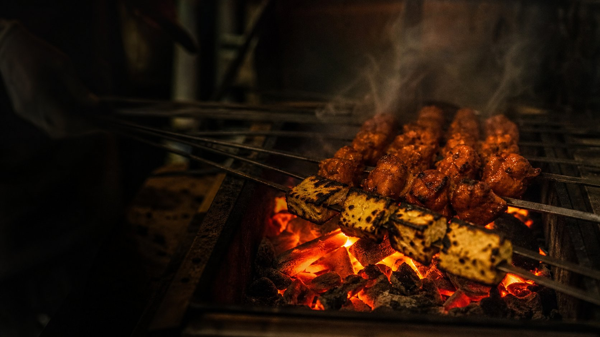

# Ember & Oak

> **⚠️ Concept demo website.** Ember & Oak is a **fictional restaurant**. This
> is a portfolio/design piece — the address, phone number, email and reviews are
> concept placeholders. A subtle label in the footer identifies the site as a
> concept demo.

A production-quality marketing site for an imagined wood-fired Indian grill in
Surat. Editorial layout, warm cream palette, hairline rules, restrained motion.



---

## Stack

| | |
|---|---|
| Framework | Next.js 16 (App Router, static generation) |
| Language | TypeScript (strict, no `any`) |
| Styling | Tailwind CSS v4 with CSS-variable design tokens |
| Motion | framer-motion (scroll fade-up only) |
| Icons | lucide-react |
| Fonts | Fraunces + Inter via `next/font/local` |
| WhatsApp | Centralized URL builder (`lib/whatsapp.ts`) |
| Forms | Web3Forms with client-side validation & safety guard |
| Deploy target | Vercel |

---

## Quick start

```bash
npm install
cp .env.example .env.local   # then add your Web3Forms key (see below)
npm run dev                  # http://localhost:3000
```

Other scripts:

```bash
npm run build    # production build — must pass clean
npm run start    # serve the production build
npm run lint     # eslint
```

---

## Where to put your Web3Forms key

The two forms (`/reserve` and `/private-dining`) post to
[Web3Forms](https://web3forms.com). They ship **disabled** until you supply a key.

1. Get a free access key at <https://web3forms.com> (enter the inbox you want
   the enquiries delivered to — Web3Forms emails you the key).
2. Open **`.env.local`** in the project root and replace the placeholder:

   ```env
   NEXT_PUBLIC_WEB3FORMS_KEY=paste-your-real-access-key-here
   ```

   `.env.local` is **gitignored and must never be committed**; `.env.example`
   is the committed template.
3. Restart the dev server — `NEXT_PUBLIC_*` values are inlined at build time.
4. On Vercel, add the same variable under
   **Project → Settings → Environment Variables**, then redeploy.

**Until a real key is present**, both forms render an inline notice —
*"Form not configured — add your Web3Forms access key to .env.local."* — and the
submit button stays disabled.

A submission is only treated as successful upon a confirmed **HTTP 200** response
from the Web3Forms API. On submission, a booking request reference (e.g. `EO-7X2K`)
and summary are generated, with one-click actions to copy details or send the request
directly via WhatsApp to `+91 63523 69937`.

Optional: set `NEXT_PUBLIC_SITE_URL` to your production domain so canonical and
Open Graph URLs are absolute (defaults to `https://emberandoak.vercel.app`).

---

## Editing content & WhatsApp

**All business content lives in [`content/site.ts`](content/site.ts)**, typed by
the `SiteConfig` interface. Components never hardcode copy, prices, hours or
links — change the menu, testimonials, hours or contact details there and every
page updates.

```ts
export const site: SiteConfig = {
  business: {
    name: "Ember & Oak",
    phone: "+91 63523 69937",
    phoneHref: "tel:+916352369937",
    ...
  },
  menu: [ { id: "starters", label: "Starters", dishes: [...] }, ... ],
  ...
};
```

WhatsApp links are centralized in [`lib/whatsapp.ts`](lib/whatsapp.ts) and use
the official business number `916352369937`.

### Design tokens

Tokens are declared once as CSS variables in
[`app/globals.css`](app/globals.css) and mapped to Tailwind utilities in
[`tailwind.config.ts`](tailwind.config.ts). Components use the semantic classes
(`bg-bg`, `text-ink`, `text-muted`, `bg-primary`, `border-hairline`,
`font-display`) — there are **no hardcoded hex values in components**.

| Token | Value | Use |
|---|---|---|
| `--color-bg` | `#FAF7F2` | warm cream page background |
| `--color-surface` | `#FFFFFF` | cards and panels |
| `--color-ink` | `#1C1917` | primary text |
| `--color-muted` | `#78716C` | secondary text |
| `--color-primary` | `#B45309` | buttons and accents only |
| `--color-hairline` | `#E7E5E4` | 1px dividers |

---

## Structure

```
app/
  (pages)/
    page.tsx                 /                home
    menu/page.tsx            /menu            menu categories + 72px thumbnails
    reserve/page.tsx         /reserve         reservation request
    private-dining/page.tsx  /private-dining  rooms & set menus
  layout.tsx                 shell: navbar, footer, WhatsApp FAB
  globals.css                design tokens + keyframes
  fonts.ts                   Fraunces + Inter local font loaders
  not-found.tsx              custom 404
  sitemap.ts  robots.ts
components/
  blocks/                    Navbar, Hero, Marquee, DishStrip, AboutTeaser,
                             Testimonials, HoursLocation, CTABanner, Footer,
                             WhatsAppFab, MenuTabs, ReserveForm, ReservePanels,
                             BookingSuccess, EnquiryForm, FormNotice
  ui/                        Button, SectionHeading, MenuRow, DishImage,
                             Field, FadeUp, JsonLd
content/site.ts              all business data (SiteConfig)
lib/
  seo.ts                     metadata builder + JSON-LD generators
  forms.ts                   Web3Forms key guard, submit, validators
  tokens.ts                  token values for non-CSS contexts (theme-color)
  whatsapp.ts                centralized WhatsApp URL builder (916352369937)
public/images/               hero, signature, and private dining photography
public/images/dishes/        all 16 menu dish photographs
```

---

## Accessibility & SEO

- Semantic landmarks, one `<h1>` per page, skip-to-content link.
- Every input has a `<label>`; errors are wired via `aria-invalid` /
  `aria-describedby` and announced with `role="alert"`.
- Menu tabs follow the ARIA tabs pattern with arrow-key roving focus.
- Visible `focus-visible` rings; inputs are 16px to prevent iOS zoom.
- Contrast meets WCAG AA: ink on cream 16.4:1, muted on cream 4.49:1,
  primary `#B45309` on cream 4.7:1, cream on primary 4.7:1.
- `prefers-reduced-motion` disables all animation.
- Unique title/description/canonical per page, Open Graph + Twitter cards (1200×630),
  `Restaurant` / `Menu` / `BreadcrumbList` JSON-LD, sitemap and robots.

---

## Known limitations

- **Fictional business.** Content, reviews and contact details are concept pieces.
- **Request-only forms.** Submissions are booking requests confirmed manually via
  WhatsApp; there is no automated table locking or payment processing.
- **Photography is served locally** in `public/images/` and `public/images/dishes/`
  with no external third-party runtime image dependency.
- **No dark mode, i18n, CMS, cart, accounts or cookie banner** — deliberately
  out of scope.
- The Google Maps embed is a standard `iframe`.

---

## Licence

Demo/portfolio use. "Ember & Oak" is not a real business.
